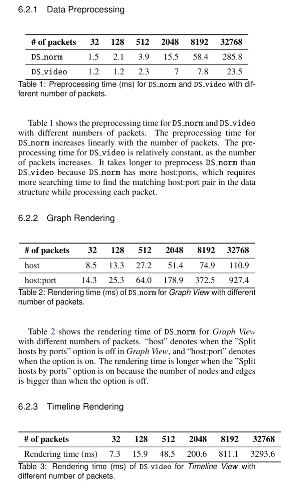

# Computation Time Evaluation
- 세 군데에서 타임스탬프를 측정함 (각 타임스탬프를 찍는 위치는 코드에서 `performance.now()`로 검색해보면 나옴)
    1. `initHostData`와 `initPortData` (GraphView.js)
    2. CreateGraph (GraphView.js)
    3. Timeline rendering (TimelineView.js)
- Evaluation에 사용한 dataset : <https://snu-cse-mmlab.synology.me/drive/d/f/11B6WaCU3qXu60lh5GlXkFl6CJrHyGds>
- 실험 결과 : 논문의 Evaluation section에 적어둠
    